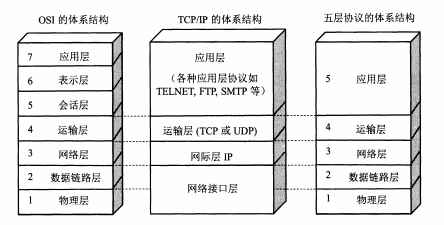
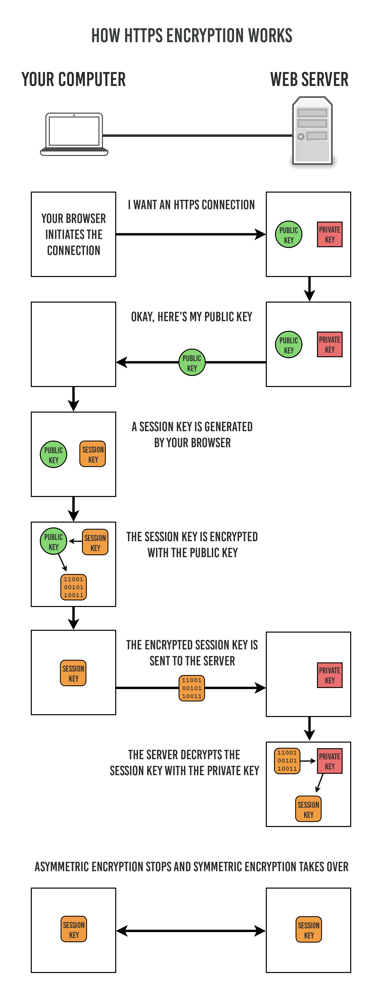

<!-- TOC -->

- [1. 操作系统](#1-操作系统)
    - [1.1. 基本特征](#11-基本特征)
        - [1.1.1. 并发](#111-并发)
        - [1.1.2. 共享](#112-共享)
        - [1.1.3. 虚拟](#113-虚拟)
        - [1.1.4. 异步](#114-异步)
    - [1.2. 基本功能](#12-基本功能)
    - [1.3. 系统调用](#13-系统调用)
    - [1.4. 宏内核和微内核](#14-宏内核和微内核)
        - [1.4.1. 宏内核](#141-宏内核)
        - [1.4.2. 微内核](#142-微内核)
    - [1.5. 中断分类](#15-中断分类)
        - [1.5.1. 外中断](#151-外中断)
        - [1.5.2. 异常](#152-异常)
        - [1.5.3. 陷入](#153-陷入)
- [2. 网络](#2-网络)
    - [2.1. 网络模型](#21-网络模型)
        - [2.1.1. OSI（Open System Interconnection 开放系统互连）七层模型](#211-osiopen-system-interconnection-开放系统互连七层模型)
        - [2.1.2. 五层协议](#212-五层协议)
        - [2.1.3. TCP/IP 四层模型](#213-tcpip-四层模型)
    - [2.2. HTTP](#22-http)
        - [2.2.1. HTTP 方法](#221-http-方法)
        - [2.2.2. HTTP状态码分类](#222-http状态码分类)
        - [2.2.3. 具体状态码](#223-具体状态码)
        - [2.2.4. HTTP 安全问题](#224-http-安全问题)
        - [2.2.4. HTTP 和 TCP 的区别，各层网络模型协议和其他概念](#224-http-和-tcp-的区别各层网络模型协议和其他概念)
    - [2.3. TCP三次握手和四次挥手（连接三次，断开四次）](#23-tcp三次握手和四次挥手连接三次断开四次)
        - [2.3.1. 连接握手](#231-连接握手)
        - [2.3.2. 关闭挥手](#232-关闭挥手)
    - [2.4. HTTPS 原理，非对称加密和混合加密算法](#24-https-原理非对称加密和混合加密算法)
        - [2.4.1. 通讯步骤](#241-通讯步骤)
        - [2.4.2. SSL 功能](#242-ssl-功能)
        - [2.4.3. HTTPS 缺点](#243-https-缺点)
- [3. 网络应用](#3-网络应用)
    - [3.1. 短连接与长连接](#31-短连接与长连接)
    - [3.2. Cookie 和 Session](#32-cookie-和-session)
    - [3.3. Web 攻击方式和防范](#33-web-攻击方式和防范)
        - [3.3.1. XSS 跨站脚本攻击](#331-xss-跨站脚本攻击)
        - [3.3.2. CSRF 跨站请求伪造](#332-csrf-跨站请求伪造)
        - [3.3.3. SQL 注入](#333-sql-注入)
    - [3.4. 网络代理](#34-网络代理)
        - [3.4.1. 类型](#341-类型)
        - [3.4.2. 作用](#342-作用)

<!-- /TOC -->

## 1. 操作系统
详细参考 https://github.com/CyC2018/CS-Notes/blob/master/notes/%E8%AE%A1%E7%AE%97%E6%9C%BA%E6%93%8D%E4%BD%9C%E7%B3%BB%E7%BB%9F%20-%20%E6%A6%82%E8%BF%B0.md
### 1.1. 基本特征
#### 1.1.1. 并发
并发是指宏观上在一段时间内能同时运行多个程序，而并行则指同一时刻能运行多个指令。  
并行需要硬件支持，如多流水线、多核处理器或者分布式计算系统。  
操作系统通过引入进程和线程，使得程序能够并发运行。

#### 1.1.2. 共享
共享是指系统中的资源可以被多个并发进程共同使用。  
有两种共享方式：互斥共享和同时共享。  
互斥共享的资源称为临界资源，例如打印机等，在同一时刻只允许一个进程访问，需要用同步机制来实现互斥访问。

#### 1.1.3. 虚拟
虚拟技术把一个物理实体转换为多个逻辑实体。  
主要有两种虚拟技术：时（时间）分复用技术和空（空间）分复用技术。  
多个进程能在同一个处理器上并发执行使用了时分复用技术，让每个进程轮流占用处理器，每次只执行一小个时间片并快速切换。  
虚拟内存使用了空分复用技术，它将物理内存抽象为地址空间，每个进程都有各自的地址空间。地址空间的页被映射到物理内存，地址空间的页并不需要全部在物理内存中，当使用到一个没有在物理内存的页时，执行页面置换算法，将该页置换到内存中。

#### 1.1.4. 异步
异步指进程不是一次性执行完毕，而是走走停停，以不可知的速度向前推进。

### 1.2. 基本功能
1. 进程管理  
进程控制、进程同步、进程通信、死锁处理、处理机调度等。

2. 内存管理  
内存分配、地址映射、内存保护与共享、虚拟内存等。

3. 文件管理  
文件存储空间的管理、目录管理、文件读写管理和保护等。

4. 设备管理  
完成用户的 I/O 请求，方便用户使用各种设备，并提高设备的利用率。  
主要包括缓冲管理、设备分配、设备处理、虛拟设备等。

### 1.3. 系统调用
如果一个进程在用户态需要使用内核态的功能，就进行系统调用从而陷入内核，由操作系统代为完成。

Linux 的系统调用主要有以下这些：

|Task |	Commands|
|  ----  | ----  |
进程控制 |	fork(); exit(); wait();|
进程通信 |	pipe(); shmget(); mmap();|
文件操作 |	open(); read(); write();|
设备操作 |	ioctl(); read(); write();|
信息维护 |	getpid(); alarm(); sleep();|
安全 |	chmod(); umask(); chown();|

### 1.4. 宏内核和微内核
#### 1.4.1. 宏内核
宏内核是将操作系统功能作为一个紧密结合的整体放到内核。

由于各模块共享信息，因此有很高的性能。

#### 1.4.2. 微内核
由于操作系统不断复杂，因此将一部分操作系统功能移出内核，从而降低内核的复杂性。移出的部分根据分层的原则划分成若干服务，相互独立。

在微内核结构下，操作系统被划分成小的、定义良好的模块，只有微内核这一个模块运行在内核态，其余模块运行在用户态。

因为需要频繁地在用户态和核心态之间进行切换，所以会有一定的性能损失。

### 1.5. 中断分类
#### 1.5.1. 外中断
由 CPU 执行指令以外的事件引起，如 I/O 完成中断，表示设备输入/输出处理已经完成，处理器能够发送下一个输入/输出请求。此外还有时钟中断、控制台中断等。

#### 1.5.2. 异常
由 CPU 执行指令的内部事件引起，如非法操作码、地址越界、算术溢出等。

#### 1.5.3. 陷入
在用户程序中使用系统调用。

## 2. 网络
### 2.1. 网络模型

#### 2.1.1. OSI（Open System Interconnection 开放系统互连）七层模型
- 应用层 ：为特定应用程序提供数据传输服务，例如 HTTP、DNS 等协议。数据单位为报文。

- 表示层 ：数据压缩、加密以及数据描述，这使得应用程序不必关心在各台主机中数据内部格式不同的问题。

- 会话层 ：建立及管理会话。

- 传输层 ：为进程提供通用数据传输服务。由于应用层协议很多，定义通用的传输层协议就可以支持不断增多的应用层协议。
运输层包括两种协议，TCP 主要提供完整性服务，UDP 主要提供及时性服务：
    - 传输控制协议 TCP，提供面向连接、可靠的数据传输服务，数据单位为报文段；
    - 用户数据报协议 UDP，提供无连接（没有建立连接，没有保持固定连接）、尽最大努力的数据传输服务，数据单位为用户数据报文。

- 网络层 ：为主机提供数据传输服务。而传输层协议是为主机中的进程提供数据传输服务。网络层把传输层传递下来的报文段或者用户数据报封装成分组。

- 数据链路层 ：网络层针对的还是主机之间的数据传输服务，而主机之间可以有很多链路，链路层协议就是为同一链路的主机提供数据传输服务。数据链路层把网络层传下来的分组封装成帧。

- 物理层 ：考虑的是怎样在传输媒体上传输数据比特流，而不是指具体的传输媒体。物理层的作用是尽可能屏蔽传输媒体和通信手段的差异，使数据链路层感觉不到这些差异。

#### 2.1.2. 五层协议
五层协议没有表示层和会话层，而是将这些功能留给应用程序开发者处理。

#### 2.1.3. TCP/IP 四层模型
它只有四层，相当于五层协议中数据链路层和物理层合并为网络接口层。  
TCP/IP 体系结构不严格遵循 OSI 分层概念，应用层可能会直接使用 IP 层或者网络接口层。

其他详细说明参考  https://blog.csdn.net/cc1949/article/details/79063439

### 2.2. HTTP
#### 2.2.1. HTTP 方法
- GET 获取资源。当前网络请求中，绝大部分使用的是 GET 方法。
- HEAD 获取报文首部。和 GET 方法类似，但是不返回报文实体主体部分。主要用于确认 URL 的有效性以及资源更新的日期时间等。
- POST 传输实体主体。POST 主要用来传输数据，而 GET 主要用来获取资源。
- PUT 上传文件。由于自身不带验证机制，任何人都可以上传文件，一次存在安全性问题，一般不使用该方法。
- PATCH 对资源进行部分修改。PUT 也可以用于修改资源，但是只能完全替代原始资源，PATCH 允许部分修改。
- DELETE 删除文件。与 PUT 功能相反，并且同样不带验证机制。
- OPTIONS 查询支持的方法。查询指定的 URL 能够支持的方法，会返回 Allow: GET, POST, HEAD, OPTIONS 这样的内容。
- CONNECT 要求在与代理服务器通信时建立隧道。使用 SSL（Secure Sockets Layer，安全套接层）和 TLS（Transport Layer Security，传输层安全）协议把通信内容加密后经网络隧道传输。
- TRACE 追踪路径。服务器会将通信路径返回给客户端。  
    发送请求时，在 Max-Forwards 首部字段中填入数值，每经过一个服务器就会减 1，当数值为 0 时就停止传输。  
    通常不会使用 TRACE，并且它容易受到 XST 攻击（Cross-Site Tracing，跨站追踪）。

#### 2.2.2. HTTP状态码分类
- 1XX 信息性状态码。接收的请求正在处理
- 2XX 成功状态码。请求正常处理完毕
- 3XX 重定向状态码。需要进行附加操作以完成请求
- 4XX 客服端错误状态码。服务器无法处理请求
- 5XX 服务器错误状态码。服务器处理请求出错

#### 2.2.3. 具体状态码
- 200 ok
- 204 No Content 请求成功，不包含实体
- 301 永久重定向
- 302 临时重定向
- 400 Bad Request 请求有语法错误
- 401 认证失败
- 403 请求拒绝
- 404 Not Found
- 500 服务器内部错误（程序异常抛出之类错误）
- 503 Service Unavailable 服务不可达（oom，栈溢出宕机等情况，无法处理请求）

#### 2.2.4. HTTP 安全问题
- 明文通讯，内容可能会被窃听；
- 不验证身份，通信方的身份有可能遭遇伪装；
- 不验证数据完整性，报文有可能遭篡改。

#### 2.2.4. HTTP 和 TCP 的区别，各层网络模型协议和其他概念
HTTP 和 TCP 是不同层面的协议，作用不同，本质没有可比性，但就是有人喜欢把这两个搞一起
- TCP 是传输层协议，定义数据传输和连接方式规范。解决数据如何在网络中传输；
- HTTP 是应用层协议，定义的是传输数据的内容和规范。解决如何包装数据。

其他协议
- 在网络层中有 IP 协议、ICMP 协议、ARP 协议和 BOOTP 协议；
- 在传输层有 TCP 协议和 UDP 协议；
- 在应用层中有 FTP、HTTP、TELNET、SMTP、DNS 等协议。

Socket 是应用层与 TCP/IP 协议族通讯的中间软件抽象层，它是一组接口，TCP/IP 的网络 API。

### 2.3. TCP三次握手和四次挥手（连接三次，断开四次）
#### 2.3.1. 连接握手
- 第一步：客户端发送 syn（同步应答编号）包到服务器，等确认
- 第二步：服务的收到 syn 包，确认syn并向客户端发送 syn 和 ack（确认应答）包
- 第三步：客户端收到 syn 和 ack 包之后向服务端发送确认包 ack，完毕双发进入 ESTABLISHED（TCP 连接成功）状态，完成三次握手
#### 2.3.2. 关闭挥手
- 第一步：客户端发送 FIN 报文到服务端
- 第二步：服务端收到连接释放报文后发出确认 ack
- 第三步：服务端若数据发送完毕了，发送 FIN=1 连接释放报文到客户端
- 第四步：客户端收到回复后，发送确认。经过2个最长报文段寿命后，客户端 CLOSE；服务器收到确认后，立刻进入 CLOSE 状态

为什么：关闭连接时，服务端收到 FIN 报文后，不会立即关闭连接，只回复 ACK 报文，要等服务端全部报文发送完了才发送 FIN 报文，所以多了一步。

### 2.4. HTTPS 原理，非对称加密和混合加密算法
#### 2.4.1. 通讯步骤
对称密钥加密方式的传输效率更高，但是无法安全地将密钥 Secret Key 传输给通信方。而非对称密钥加密方式可以保证传输的安全性，因此我们可以利用非对称密钥加密方式将 Secret Key 传输给通信方。HTTPS 采用混合的加密机制。  

**步骤：**  
客户端发送请求；  
服务端将公钥证书返回客户端；  
客户端验证公钥证书；  
客户端使用随机数进行加密，生成所使用的对称密钥（Secret Key），然后用证书加密后发送给服务端；  
服务端用私钥解密得到对称密钥；  
服务端使用对称密钥加密明文内容，发送给客户端；  
客户端使用对称密钥解密。  

下图中的 Session Key 就是 Secret Key

#### 2.4.2. SSL 功能
- 加密（防窃听）
- 认证（防伪装）
- 完整性保护（防篡改）

#### 2.4.3. HTTPS 缺点
- 需要加密解密，因此速度会更慢；
- 证书费用

## 3. 网络应用
### 3.1. 短连接与长连接
当浏览器访问一个包含多张图片的 HTML 页面时，除了请求访问的 HTML 页面资源，还会请求图片资源。如果每进行一次 HTTP 通信就要新建一个 TCP 连接，那么开销会很大。

长连接只需要建立一次 TCP 连接就能进行多次 HTTP 通信。
- 从 HTTP/1.1 开始默认是长连接的，如果要断开连接，需要由客户端或者服务器端提出断开，使用 Connection : close；
- 在 HTTP/1.1 之前默认是短连接的，如果需要使用长连接，则使用 Connection : Keep-Alive。

### 3.2. Cookie 和 Session
HTTP 协议是无状态的，主要是为了让 HTTP 协议尽可能简单，使得它能够处理大量事务。HTTP/1.1 引入 Cookie 来保存状态信息。  

Cookie 是服务器发送到用户浏览器并保存在本地的一小块数据，它会在浏览器之后向同一服务器再次发起请求时被携带上，用于告知服务端两个请求是否来自同一浏览器。由于之后每次请求都会需要携带 Cookie 数据，因此会带来额外的性能开销（尤其是在移动环境下）。  

除了可以将用户信息通过 Cookie 存储在用户浏览器中，也可以利用 Session 存储在服务器端，存储在服务器端的信息更加安全。Session 可以存储在服务器上的文件、数据库或者内存中。也可以将 Session 存储在 Redis 这种内存型数据库中，效率会更高。

应该注意 Session ID 的安全性问题，不能让它被恶意攻击者轻易获取，那么就不能产生一个容易被猜到的 Session ID 值。此外，还需要经常重新生成 Session ID。在对安全性要求极高的场景下，例如转账等操作，除了使用 Session 管理用户状态之外，还需要对用户进行重新验证，比如重新输入密码，或者使用短信验证码等方式。

### 3.3. Web 攻击方式和防范
#### 3.3.1. XSS 跨站脚本攻击
- 改成纯前端渲染，把代码
- 对 HTML 做充分转义
- 禁止外域代码（次）
- 限制长度，HTTP-Only禁止Javascript读取Cookie，加验证码（次）
#### 3.3.2. CSRF 跨站请求伪造
- 使用 POST，限制使用 GET
- 将 Cookie 设置为 HTTP-Only
- 增加 token 检验
#### 3.3.3. SQL 注入
- 检查变量数据类型和格式
- 过滤特殊符号
- 绑定变量，使用预编译语句（参数化绑定）

### 3.4. 网络代理
#### 3.4.1. 类型
正向代理：用户察觉得到正向代理的存在。例如内网机器通过代理访问公网。  
反向代理：一般位于内部网络中，用户察觉不到。例如 nginx 反向代理多个服务。

#### 3.4.2. 作用
- 缓存
- 负载均衡
- 网络访问控制
- 访问日志记录

